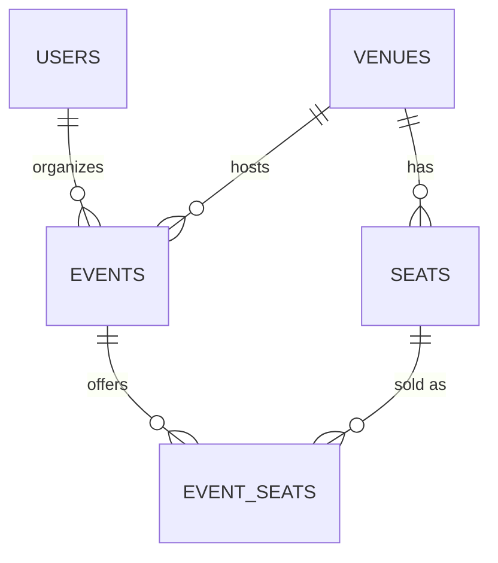

TicketRush: one paragraph: what problem it solves (high-concurrency ticket booking with no double bookings), and what’s built so far.
Tech stack: Java 21, Spring Boot 4, PostgreSQL, Flyway, Spring Security (JWT), Testcontainers, Docker.
Run it locally: the exact commands (docker compose up -d, set JWT_SECRET, set the dev profile, mvnw.cmd spring-boot:run) and the seeded demo logins.
API overview: a table of endpoints with who can call each.
Data model: an ER diagram. Mermaid works directly in GitHub:

Design decisions: why Flyway owns the schema, why DTOs, why the unique constraint and version column exist.
Roadmap: the weeks 2 to 8 plan.